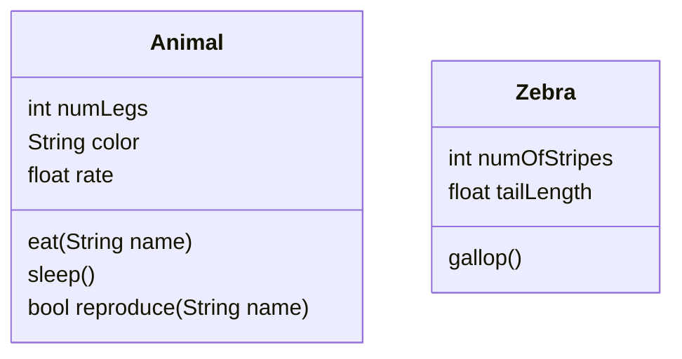

 # UML Diagram for UAT Space Program

 The uml diagram needs 2 classes with 3 properties and 3 methods.

```mermaid
     classDiagram
        class Animal{
            int numLegs
            String color
            float rate
            eat(String name)
            sleep()
            bool reproduce(String name)
        }
    class Zebra{
        int numOfStripes
        float tailLength
        gallop()
    }

```